# Makina Protocol - System Architecture Diagram

```mermaid
graph TB
    subgraph "Hub Chain (Ethereum Mainnet)"
        subgraph "Machine (Strategy Vault)"
            Depositor[Depositor Contract<br/>Entry Point]
            AsyncRedeemer[AsyncRedeemer<br/>ERC-721 Queue]
            FeeManager[Fee Manager<br/>Fixed & Performance Fees]
            MachineToken[Machine Token<br/>ERC-20 Shares]
            MachineCore[Machine Core<br/>AUM Calculation<br/>Share Price Management]
        end
        
        HubCaliber[Hub Caliber<br/>Local Execution Engine]
        HubMailbox[Hub Mailbox<br/>Bridge Management]
        SecurityModule[Security Module<br/>Insurance Pool<br/>Staking & Slashing]
        
        Depositor --> MachineCore
        AsyncRedeemer --> MachineCore
        MachineCore --> MachineToken
        MachineCore --> FeeManager
        MachineCore --> HubCaliber
        MachineCore --> SecurityModule
        HubCaliber --> HubMailbox
    end
    
    subgraph "Spoke Chain 1 (e.g., Arbitrum)"
        SpokeCaliber1[Spoke Caliber<br/>Execution Engine]
        SpokeMailbox1[Caliber Mailbox<br/>Access Control & Bridging]
        
        subgraph MakinaVM1["MakinaVM 1"]
            MerkleTree1[Merkle Tree<br/>Allowed Instructions]
            Positions1[Positions<br/>Asset Deployments]
            BaseTokens1[Base Tokens<br/>Liquid Assets]
        end
        
        SpokeCaliber1 --> MakinaVM1
        SpokeCaliber1 --> SpokeMailbox1
    end
    
    subgraph "Spoke Chain 2 (e.g., Base)"
        SpokeCaliber2[Spoke Caliber<br/>Execution Engine]
        SpokeMailbox2[Caliber Mailbox<br/>Access Control & Bridging]
        
        subgraph MakinaVM2["MakinaVM 2"]
            MerkleTree2[Merkle Tree<br/>Allowed Instructions]
            Positions2[Positions<br/>Asset Deployments]
            BaseTokens2[Base Tokens<br/>Liquid Assets]
        end
        
        SpokeCaliber2 --> MakinaVM2
        SpokeCaliber2 --> SpokeMailbox2
    end
    
    subgraph "External DeFi Protocols"
        Aave[Aave<br/>Lending]
        Uniswap[Uniswap<br/>Liquidity]
        Compound[Compound<br/>Yield]
        OtherProtocols[Other Protocols<br/>Various Strategies]
    end
    
    subgraph "Cross-Chain Infrastructure"
        Wormhole[Wormhole Network<br/>CCQ & Validators]
        NTT[Native Token Transfer<br/>Machine Token Bridge]
        BridgeAdapters[Bridge Adapters<br/>Multiple Protocols]
    end
    
    subgraph "Oracle Infrastructure"
        OracleRegistry[Oracle Registry<br/>Price Aggregation]
        Chainlink[Chainlink Feeds<br/>Price Data]
        
        OracleRegistry --> Chainlink
    end
    
    subgraph "Governance Layer"
        AccessManager[Access Manager<br/>Protocol-Wide Roles]
        
        subgraph "Per-Strategy Entities"
            Operator[Operator<br/>Daily Operations]
            RiskManager[Risk Manager<br/>Risk Parameters]
            SecurityCouncil[Security Council<br/>Emergency Override]
            RootGuardians[Root Guardians<br/>Merkle Root Veto]
        end
        
        Timelock[Timelock<br/>Delay Mechanism]
        
        AccessManager --> Operator
        AccessManager --> RiskManager
        RiskManager --> Timelock
        SecurityCouncil --> Timelock
        RootGuardians --> Timelock
    end
    
    Users[Users<br/>Deposit & Redeem] --> Depositor
    Users --> AsyncRedeemer
    Users --> SecurityModule
    
    HubMailbox <--> |Bridge Assets| BridgeAdapters
    SpokeMailbox1 <--> |Bridge Assets| BridgeAdapters
    SpokeMailbox2 <--> |Bridge Assets| BridgeAdapters
    
    SpokeCaliber1 --> |Deploy Assets| Aave
    SpokeCaliber1 --> |Deploy Assets| Uniswap
    SpokeCaliber2 --> |Deploy Assets| Compound
    SpokeCaliber2 --> |Deploy Assets| OtherProtocols
    
    SpokeCaliber1 --> |Account Data| Wormhole
    SpokeCaliber2 --> |Account Data| Wormhole
    Wormhole --> |Aggregate AUM| MachineCore
    
    MachineToken <--> |Cross-Chain Transfer| NTT
    
    MachineCore --> |Price Queries| OracleRegistry
    SpokeCaliber1 --> |Price Queries| OracleRegistry
    SpokeCaliber2 --> |Price Queries| OracleRegistry
    
    Operator --> |Execute Instructions| HubCaliber
    Operator --> |Execute Instructions| SpokeCaliber1
    Operator --> |Execute Instructions| SpokeCaliber2
    
    RiskManager --> |Update Parameters| MachineCore
    RiskManager --> |Update Merkle Root| SpokeCaliber1
    RiskManager --> |Update Merkle Root| SpokeCaliber2
    
    SecurityCouncil --> |Recovery Mode| MachineCore
    SecurityCouncil --> |Recovery Mode| SpokeCaliber1
    SecurityCouncil --> |Recovery Mode| SpokeCaliber2
```

## Key Components Legend

### Machine (Hub Chain)
- **Depositor**: Entry point for user deposits
- **AsyncRedeemer**: ERC-721 based redemption queue
- **Machine Core**: Central AUM and share price calculation
- **Machine Token**: ERC-20 tokenized shares
- **Fee Manager**: Manages fixed and performance fees
- **Security Module**: Insurance pool with staking/slashing

### Calibers (Execution Engines)
- **Hub Caliber**: Execution engine on main chain
- **Spoke Calibers**: Execution engines on other chains
- **MakinaVM**: Virtual machine executing pre-approved instructions
- **Positions**: Deployed assets in external protocols
- **Base Tokens**: Liquid tokens held by Caliber

### Cross-Chain
- **Wormhole CCQ**: Cross-chain queries for accounting
- **NTT**: Native Token Transfer for Machine tokens
- **Bridge Adapters**: Multiple bridge protocol support
- **Caliber Mailbox**: Communication hub per chain

### Governance
- **Operator**: Daily strategy management
- **Risk Manager**: Risk parameter control
- **Security Council**: Emergency override powers
- **Root Guardians**: Merkle root veto authority
- **Timelock**: Delay mechanism for changes
