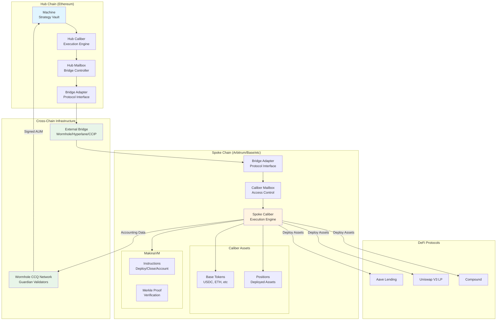
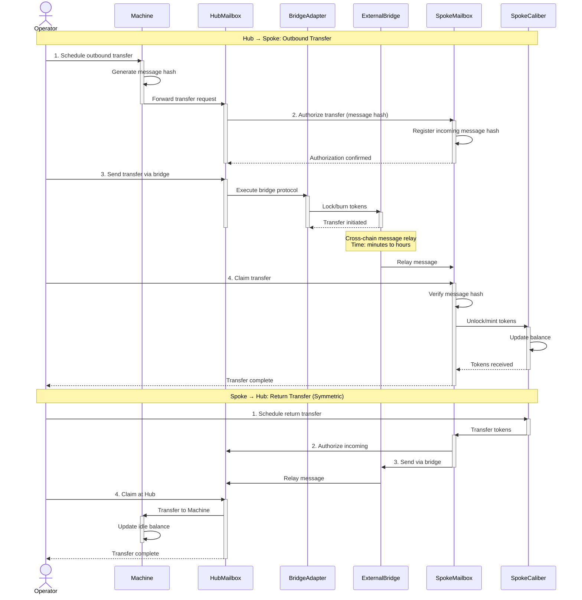
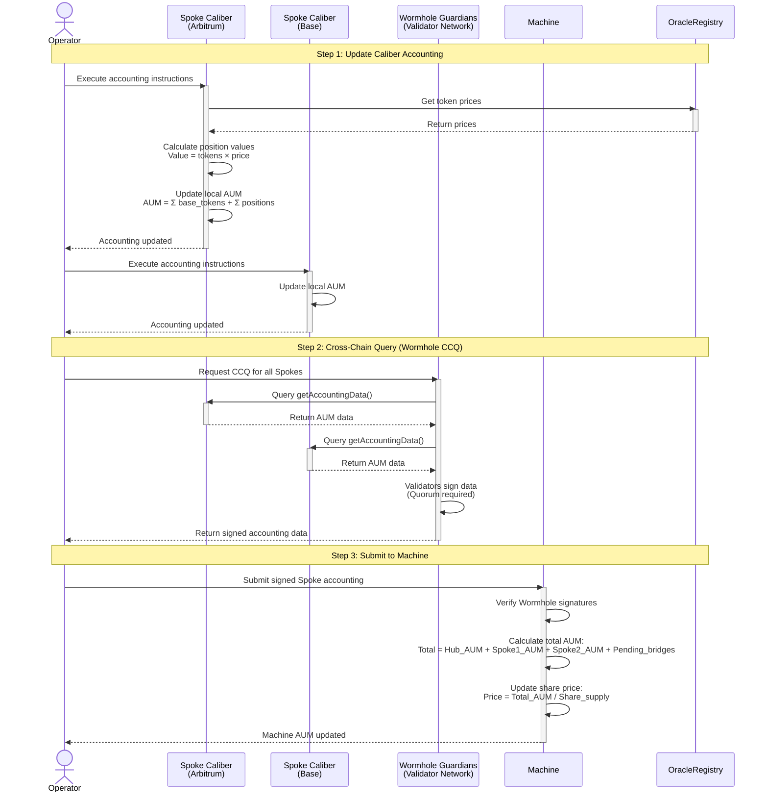
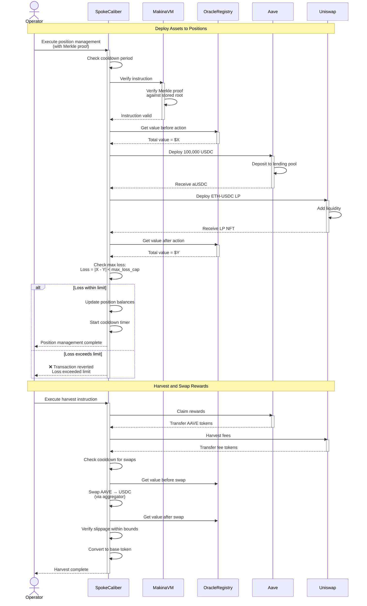

# Makina Protocol - Cross-Chain Operations Flow



## Liquidity Bridging Flow



## Cross-Chain Accounting Flow



## Position Management on Spoke Chain



## Key Cross-Chain Components

### 1. Liquidity Bridging (4-Step Process)

**Bidirectional flow: Hub ↔ Spoke**

| Step | Action | Location | Purpose |
|------|--------|----------|---------|
| 1 | Schedule | Sender | Generate message hash |
| 2 | Authorize | Recipient | Whitelist incoming transfer |
| 3 | Send | Sender | Execute bridge protocol |
| 4 | Claim | Recipient | Finalize transfer |

**Security Features:**
- Two-step authorization (schedule + authorize)
- Message hash verification
- Max loss caps on bridge transfers
- Only pre-approved bridges allowed

---

### 2. Cross-Chain Accounting (Wormhole CCQ)

**Purpose**: Aggregate AUM from all chains to Hub Machine

**Process:**
1. **Local Accounting**: Each Spoke Caliber maintains local AUM
   ```
   Caliber_AUM = Σ base_tokens + Σ position_values
   ```

2. **CCQ Request**: Operator requests Wormhole to query all Spokes

3. **Data Collection**: Wormhole guardians:
   - Call `getAccountingData()` on each Spoke Caliber
   - Collect AUM, positions, base tokens
   - Sign data with validator quorum

4. **Submission**: Signed data submitted to Machine on Hub

5. **Aggregation**: Machine calculates total:
   ```
   Total_AUM = Hub_AUM + Σ Spoke_AUM + Pending_bridges
   ```

6. **Share Price Update**:
   ```
   Share_Price = Total_AUM / Share_Supply
   ```

---

### 3. Caliber Mailbox Functions

**Access Control:**
- Specifies authorized operators per chain
- Prevents unauthorized cross-chain calls
- Chain-specific permission management

**Bridge Management:**
- Interface with multiple bridge adapters
- Schedule and claim transfers
- Verify message hashes

**Accounting Interface:**
- Expose `getAccountingData()` for Wormhole
- Return detailed AUM breakdown
- Include position values and base token balances

---

### 4. Position Management

**MakinaVM Execution:**
- Verify Merkle proof for instruction
- Execute pre-approved function calls
- Atomic transaction batching

**Safety Checks:**
- **Cooldown Period**: Minimum time between position changes
- **Max Loss Cap**: Value loss limit per transaction
- **Oracle Verification**: Before/after value comparison

**Instruction Types:**
- **Deploy**: Open or increase position
- **Close**: Decrease or exit position
- **Account**: Update position value
- **Harvest**: Claim rewards

---

### 5. Oracle Integration

**Price Feeds:**
- Chainlink oracles on each chain
- Direct or hop-based pricing (Token A → USD → Token B)
- Consistent pricing across chains

**Usage:**
- Value positions in accounting token
- Verify swap slippage
- Calculate AUM for each Caliber
- Ensure accurate share price

---

## Recovery Mode Effects on Cross-Chain

### During Recovery Mode:

**Hub Chain:**
- ❌ No outbound bridges (Hub → Spoke blocked)
- ✅ Inbound bridges allowed (Spoke → Hub)
- ❌ Deposits disabled
- ❌ AUM updates paused

**Spoke Chains:**
- ❌ Positions can only decrease (no new deployments)
- ✅ Swaps only to accounting token
- ✅ Bridge assets back to Hub
- ❌ No outbound to other Spokes

**Purpose**: Consolidate assets to Hub during emergency

---

## Bridge Adapters

**Multi-Bridge Support:**
- Wormhole NTT (Native Token Transfer)
- Hyperlane
- Chainlink CCIP
- LayerZero
- Custom implementations

**Adapter Interface:**
- Standardized send/receive functions
- Protocol-specific implementations
- Governance-approved only

**Benefits:**
- Redundancy (multiple bridge options)
- Optimization (choose best for each route)
- Risk diversification
