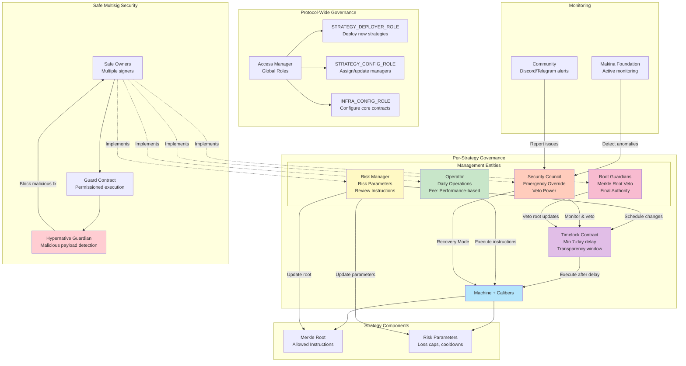
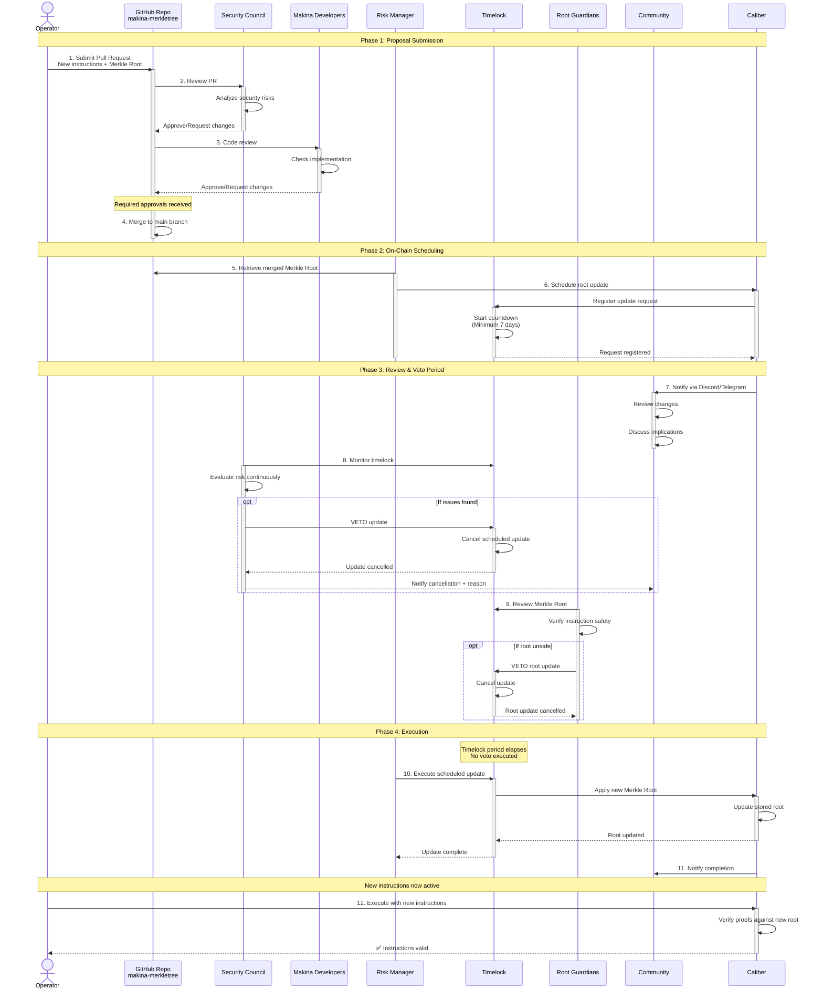
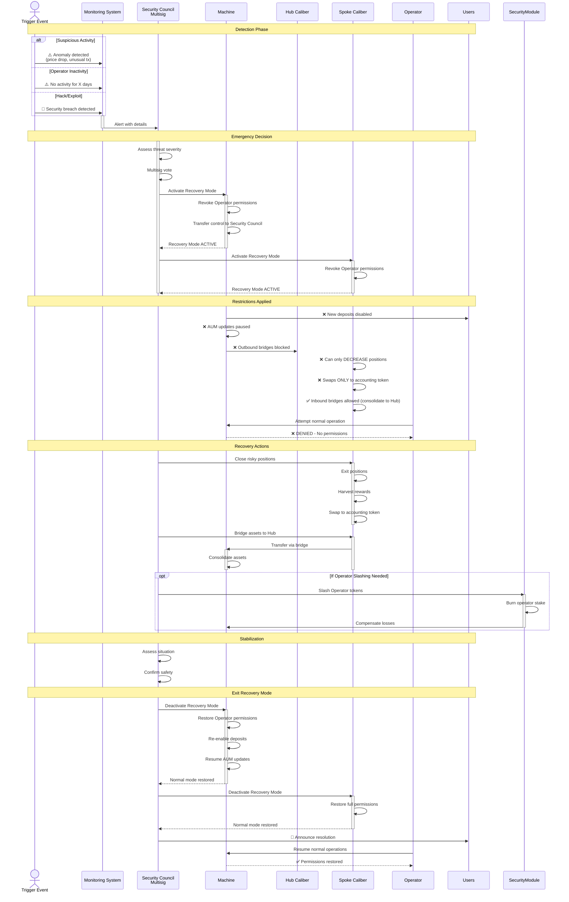
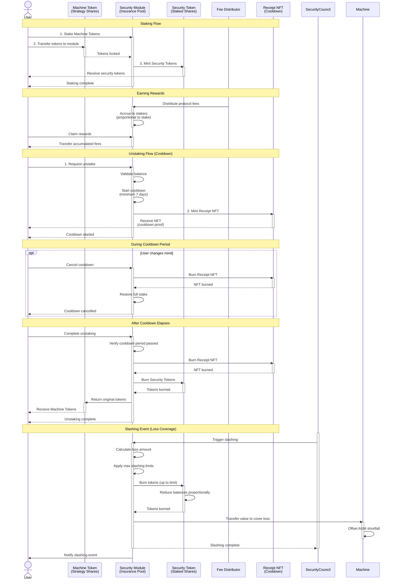
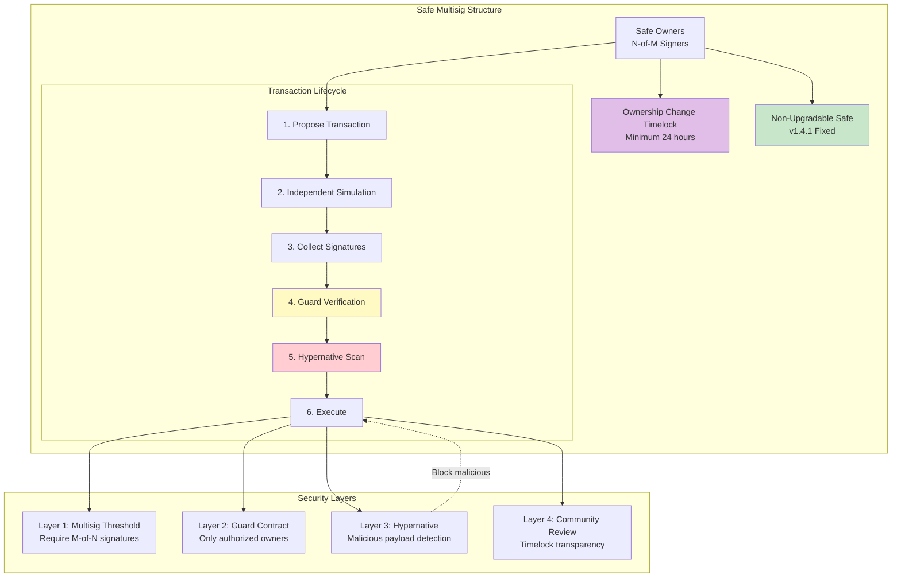

# Makina Protocol - Governance and Security Flow

## Root Update Lifecycle

## Recovery Mode Flow

## Security Module Flow

## Safe Multisig Security Architecture

## Governance Key Features

### Protocol-Wide Roles

| Role | Permissions | Scope |
|------|-------------|-------|
| **STRATEGY_DEPLOYER** | Deploy new strategies | Protocol-wide |
| **STRATEGY_CONFIG** | Assign/update strategy managers | Protocol-wide |
| **INFRA_CONFIG** | Configure core contracts (registries) | Protocol-wide |

### Per-Strategy Entities

| Entity | Responsibilities | Powers | Constraints |
|--------|-----------------|--------|-------------|
| **Operator** | Daily operations, position management, bridging | Execute pre-approved instructions | Max loss caps, cooldowns, instruction whitelist |
| **Risk Manager** | Update risk parameters, review instructions | Schedule parameter changes, propose root updates | All changes via timelock (min 7 days) |
| **Security Council** | Emergency oversight | Veto changes, activate Recovery Mode, slash operators | Cannot make routine changes |
| **Root Guardians** | Merkle root oversight | Veto root updates | Specific to instruction whitelisting |

---

## Timelock Mechanism

**Purpose**: Transparency and user protection

**Features:**
- **Minimum Delay**: 7 days (can be longer)
- **Transparency Window**: Users see upcoming changes
- **Veto Powers**: Security Council and Root Guardians can cancel
- **Scope**: All Risk Manager changes

**Protected Actions:**
- Merkle Root updates
- Risk parameter changes (loss caps, cooldowns)
- Base token additions/removals
- Fee parameter updates

---

## Recovery Mode Restrictions

### Hub Chain (Machine)
- ❌ New deposits disabled
- ❌ Outbound bridges (Hub → Spoke) blocked
- ✅ Inbound bridges (Spoke → Hub) allowed
- ❌ AUM updates paused
- ✅ Redemption queue still operates

### Spoke Chains (Calibers)
- ❌ Cannot increase or open new positions
- ✅ Can only decrease or close positions
- ❌ Swaps restricted to accounting token only
- ✅ Bridge assets back to Hub
- ❌ No cross-Spoke transfers

### Control Transfer
- All Operator permissions → Security Council
- Security Council acts as temporary operator
- Focus: Risk reduction and asset consolidation

---

## Safe Multisig Security Features

### 1. **Ownership Change Timelock**
- Minimum 24-hour delay
- Prevents sudden takeovers
- Community visibility

### 2. **Non-Upgradable Implementation**
- Fixed Safe version (v1.4.1)
- Cannot upgrade contract
- Eliminates upgrade attack vector

### 3. **Guard Contract**
- Restricts execution to authorized owners
- Prevents unauthorized transactions
- Additional permission layer

### 4. **Independent Simulation**
- Each owner simulates transactions separately
- Off-chain communication (Discord/Telegram)
- Multiple independent verifications

### 5. **Hypernative Guardian**
- Monitors transaction payloads
- Detects malicious code
- Blocks execution before on-chain
- Custom security policies

---

## Root Update Security

**Multi-Layer Review:**
1. **Operator Proposal** (GitHub PR)
2. **Security Council Review**
3. **Makina Developer Review**
4. **Merge to Public Repo**
5. **On-Chain Scheduling** (Risk Manager)
6. **Timelock Period** (7+ days)
7. **Community Review**
8. **Security Council Veto Window**
9. **Root Guardian Veto Window**
10. **Execution** (if no veto)

**Transparency:**
- All changes public in GitHub
- On-chain scheduling visible
- Community notifications
- Time for user exit if disagreement
