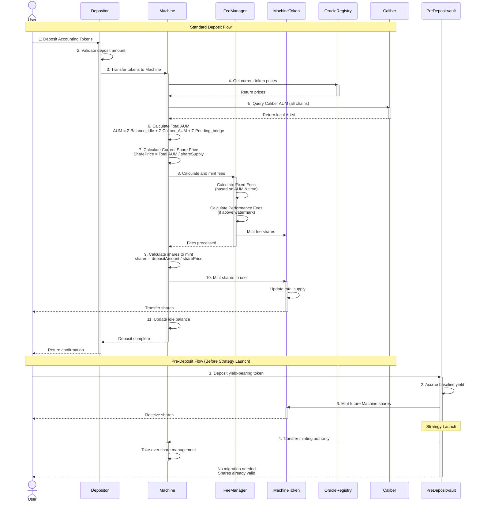

# Makina Protocol - User Deposit Flow



## Deposit Flow Details

### Standard Deposit Process

1. **User Initiates Deposit**
   - User approves and deposits Accounting Tokens to Depositor contract
   - Only the designated Accounting Token is accepted

2. **Validation**
   - Depositor validates the deposit amount and user permissions

3. **Token Transfer**
   - Accounting Tokens transferred from user to Machine contract

4. **Price Discovery**
   - Oracle Registry queried for current token prices
   - All tokens priced against the Accounting Token

5. **AUM Aggregation**
   - Query all Calibers (Hub + Spokes) for their local AUM
   - Includes idle balances, deployed positions, and pending bridges

6. **Total AUM Calculation**
   ```
   Total AUM = Σ Balance_idle + Σ Caliber_AUM + Σ Pending_bridge
   ```

7. **Share Price Calculation**
   ```
   Share Price = Total AUM / Total Share Supply
   ```

8. **Fee Processing**
   - **Fixed Fees**: Based on AUM and time elapsed
     - Split: Security Module, Operator, Makina DAO
   - **Performance Fees**: Only if above high watermark
     - Split: Operator, Makina DAO
   - Fee shares minted to respective recipients

9. **Share Minting**
   ```
   Shares to Mint = Deposit Amount / Current Share Price
   ```

10. **Token Distribution**
    - Machine Tokens (ERC-20 shares) minted to user's address
    - Total supply updated

11. **Balance Update**
    - Machine's idle balance increased by deposit amount

### Pre-Deposit Flow

**Purpose**: Build baseline liquidity before strategy launch

1. **Pre-Deposit Phase**
   - Users deposit yield-bearing tokens (e.g., stETH, aUSDC)
   - PreDepositVault holds these tokens
   - Vault's share price increases with accrued yield

2. **Share Minting**
   - PreDepositVault mints future Machine Shares immediately
   - Users earn baseline yield during pre-deposit period

3. **Strategy Launch**
   - Machine deploys and takes over minting authority
   - **No migration needed** - shares already valid Machine Tokens
   - Seamless transition from pre-deposit to active strategy

4. **Benefits**
   - Users earn yield during pre-launch
   - No gas costs for migration
   - Immediate liquidity at launch
