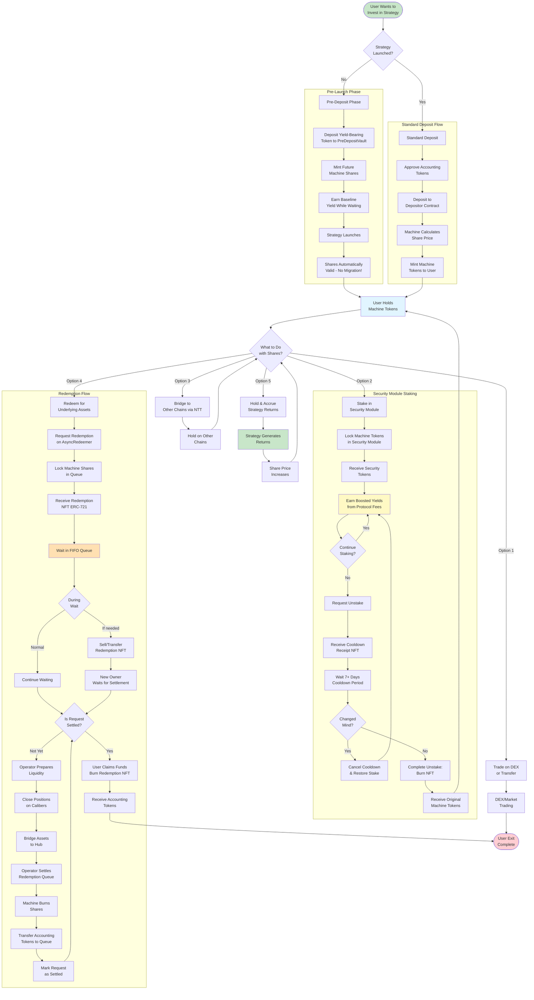

# Makina Protocol - Complete User Journey



## User Journey Stages

### 1️⃣ Entry Points

**Pre-Launch Investment:**
- Deposit yield-bearing tokens to PreDepositVault
- Earn baseline yield immediately
- Receive future Machine Shares
- Automatic migration at launch (zero friction)

**Post-Launch Investment:**
- Deposit Accounting Token (e.g., USDC, USDT)
- Machine calculates share price based on total AUM
- Receive Machine Tokens proportional to deposit
- Instant participation in strategy

---

### 2️⃣ Holding Machine Tokens

Once you hold Machine Tokens, you have **five options**:

#### Option 1: Trade or Transfer
- Machine Tokens are standard ERC-20
- Trade on DEXs (Uniswap, etc.)
- Transfer to other wallets
- Use as collateral (if supported)

#### Option 2: Stake in Security Module
- Lock tokens to earn boosted yields
- Receive Security Tokens
- Earn share of protocol fees
- Act as insurance for the strategy
- Cooldown period (7+ days) to unstake

#### Option 3: Bridge to Other Chains
- Use Wormhole NTT (Native Token Transfer)
- Bridge Machine Tokens to L2s or other chains
- Lower fees, faster transactions
- Same strategy exposure

#### Option 4: Redeem for Underlying
- Enter async redemption queue
- Receive redemption NFT
- Wait for operator settlement
- Claim accounting tokens

#### Option 5: Hold and Accrue
- Simply hold tokens
- Share price increases with strategy performance
- No additional action needed
- Compound returns automatically

---

### 3️⃣ Security Module Deep Dive

**Staking Benefits:**
- 🎁 Boosted yields from protocol fees
- 🛡️ Contribute to strategy insurance
- 📈 Participate in protocol growth

**Staking Process:**
```
Lock Machine Tokens
    ↓
Receive Security Tokens (1:1)
    ↓
Earn Protocol Fees
    ↓
[Hold or Unstake]
```

**Unstaking Process:**
```
Request Unstake
    ↓
Receive Cooldown Receipt NFT
    ↓
Wait 7+ Days
    ↓
[Cancel or Complete]
    ↓
Burn NFT & Receive Machine Tokens
```

**Risk:**
- ⚠️ Slashing possible during loss events
- ⚠️ Max slashing limits protect you
- ⚠️ Minimum balance always maintained

---

### 4️⃣ Redemption Journey

**Why Asynchronous?**
Assets are deployed in illiquid DeFi positions across multiple chains. Instant redemptions would require massive idle capital, reducing strategy efficiency.

**Timeline Example:**
```
Day 0:  Request redemption → Get NFT #42 (100 shares @ $10.50)
Day 1-5: Wait in queue, strategy operates normally
Day 6:  Operator settles queue (@ $10.65 current price)
        100 shares × $10.65 = 1,065 USDC allocated
Day 7+: Claim anytime (no expiration)
Day 10: User claims → Receive 1,065 USDC
```

**NFT Benefits:**
- 📊 Represents your place in queue
- 💱 Transferable (can sell your position)
- 🔒 Proof of redemption request
- ⏰ No expiration after settlement

**Queue Mechanics:**
- First-In-First-Out (FIFO)
- Fair ordering
- Transparent position
- Batch settlements possible

---

### 5️⃣ Strategy Performance Impact

**While You Hold:**

```
Operator Deploys Capital
    ↓
Calibers Execute on DeFi Protocols
    ↓
Positions Generate Yield
    ↓
Operator Harvests Rewards
    ↓
Cross-Chain Accounting Updates
    ↓
Machine Calculates New Share Price
    ↓
Your Tokens Worth More (or Less)
```

**Share Price Formula:**
```
Share Price = Total AUM / Total Shares

Where:
Total AUM = Hub Balance + Σ Spoke Caliber AUM + Pending Bridges
```

**Performance Impact You:**
- ✅ Share price increases → Your tokens worth more
- ❌ Share price decreases → Your tokens worth less
- 📊 Real-time tracking via oracles
- 🔄 Regular updates via Wormhole CCQ

---

### 6️⃣ Exit Options

#### Exit 1: Sell on DEX
- **Pros**: Instant liquidity, no queue
- **Cons**: Market price may differ from NAV, slippage

#### Exit 2: Async Redemption
- **Pros**: Redeem at exact share price (NAV)
- **Cons**: Wait time, depends on queue depth

#### Exit 3: Transfer/Gift
- **Pros**: No value extraction, maintain strategy exposure
- **Cons**: Recipient still subject to strategy risks

---

## Key Considerations

### 🎯 Investment Decision Points

**Before Depositing:**
- ✅ Review strategy mandate
- ✅ Check historical performance
- ✅ Understand risk parameters
- ✅ Review operator and risk manager
- ✅ Check Security Module size

**While Holding:**
- 📊 Monitor share price
- 🔍 Track strategy operations
- 🛡️ Consider Security Module staking
- 💱 Evaluate DEX liquidity

**Before Redeeming:**
- ⏰ Check redemption queue depth
- 💰 Compare DEX price vs NAV
- 📈 Consider strategy performance trend
- 🔄 Evaluate gas costs

---

### ⚠️ Risk Factors

**Strategy Risks:**
- Smart contract risk (mitigated by audits)
- Operator error (restricted by whitelists)
- Market risk (inherent to DeFi)
- Bridge risk (multiple providers, insurance)

**Redemption Risks:**
- Wait time uncertainty
- Price volatility during queue
- Operator settlement timing
- Liquidity constraints

**Mitigation:**
- Security Module insurance
- Recovery Mode protection
- Security Council oversight
- Multiple audits completed
- Max loss caps enforced

---

### 🚀 Advanced Strategies

**Yield Optimization:**
1. Deposit to strategy
2. Stake in Security Module
3. Earn strategy returns + protocol fees
4. Compound by claiming fees and re-staking

**Liquidity Provision:**
1. Hold Machine Tokens
2. Provide liquidity on DEX
3. Earn trading fees + strategy returns
4. Manage impermanent loss risk

**Cross-Chain Arbitrage:**
1. Bridge tokens to low-fee chain
2. Trade/manage on cheaper chain
3. Bridge back when needed
4. Optimize for gas costs

---

## User Types & Recommended Paths

### 🐋 Large Investor (Whale)
**Recommended Path:**
- Pre-deposit for better entry price
- Stake significant portion in Security Module
- Hold long-term for compounding
- Direct communication with Operator

### 💼 Medium Investor (Institutional)
**Recommended Path:**
- Standard deposit
- Mix of holding + Security Module
- Regular performance monitoring
- Consider OTC for redemptions

### 🎯 Small Investor (Retail)
**Recommended Path:**
- Standard deposit
- Hold or trade based on performance
- Use L2 bridges for lower fees
- Monitor community discussions

### 🏃 Active Trader
**Recommended Path:**
- Standard deposit
- Trade on DEX for quick exits
- Monitor NAV vs market price
- Arbitrage opportunities

---

## Timeline Expectations

### Deposit
- ⚡ Instant: Token transfer and share minting
- 🔄 Settlement: Same transaction

### Bridging
- ⏱️ Minutes to hours (depends on bridge)
- 🌉 Wormhole: ~15 minutes
- 🌉 Native bridges: 7 days (Ethereum → L2)

### Redemption
- 📝 Request: Instant
- ⏳ Settlement: Hours to days (depends on queue)
- 💰 Claim: Instant after settlement

### Security Module
- 🔒 Stake: Instant
- ⏰ Unstake: 7+ days cooldown
- 💵 Claim rewards: Instant

---

**User Experience Focus**: Makina prioritizes transparency, security, and flexibility while managing the complexity of cross-chain DeFi strategies behind a clean user interface.
