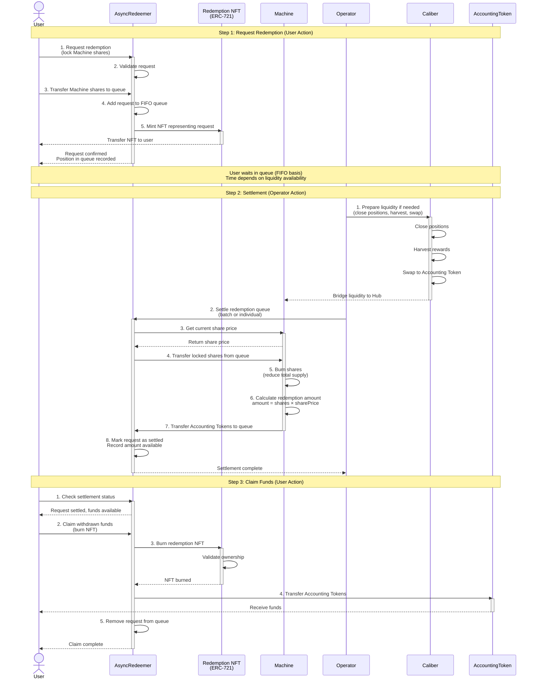

# Makina Protocol - User Redemption Flow



## Redemption Flow Details

### Why Asynchronous Redemption?

Standard ERC-4626 vaults allow instant redemptions, but Makina strategies deploy assets into illiquid positions across multiple chains. This makes atomic (same-transaction) redemptions impossible.

**AsyncRedeemer Solution**: Three-step FIFO queue with NFT-based claims

---

## Three-Step Redemption Process

### Step 1: Request Redemption (User Initiated)

**Actions:**
1. User calls `requestRedemption()` on AsyncRedeemer contract
2. User transfers Machine Shares (tokens) to the queue contract
3. Shares are locked in the queue - user cannot trade or transfer them

**Result:**
- User receives an **ERC-721 NFT** representing their redemption request
- NFT contains:
  - Request ID (position in queue)
  - Number of shares locked
  - Timestamp of request
  - Settlement status (pending/settled)

**Key Points:**
- Requests are added to a **First-In-First-Out (FIFO) queue**
- No immediate share price calculation
- User retains ownership via NFT until claim

---

### Step 2: Settlement (Operator Initiated)

**Operator Prepares Liquidity:**
1. Monitor redemption queue depth
2. If needed, prepare liquidity:
   - Close positions on Calibers
   - Harvest rewards from protocols
   - Swap tokens to Accounting Token
   - Bridge assets back to Hub Chain

**Settlement Process:**
3. Operator calls `settle()` on AsyncRedeemer
4. Can settle individual requests or batches
5. Settlement process:
   - Query current share price from Machine
   - Transfer locked shares from queue to Machine
   - Machine **burns the shares** (reducing total supply)
   - Calculate redemption amount: `shares × current_share_price`
   - Machine transfers Accounting Tokens to queue contract

**Result:**
- Shares are permanently burned
- Accounting Tokens held in queue, allocated to request
- Request marked as "settled"
- User's NFT now represents claimable funds

**Important:**
- Settlement happens at the **current share price** (not request price)
- User benefits/loses from strategy performance during wait time
- Operator incentivized to settle regularly for user satisfaction

---

### Step 3: Claim Funds (User Initiated)

**Actions:**
1. User checks settlement status (view function)
2. Once settled, user calls `claim()`
3. User's redemption NFT is burned
4. Accounting Tokens transferred from queue to user

**Result:**
- User receives Accounting Tokens
- NFT destroyed
- Request removed from queue

**Key Points:**
- **Unlimited time to claim** after settlement
- No rush or expiration
- Gas cost only when user is ready

---

## Queue Mechanics

### FIFO (First-In-First-Out)
```
Request Queue:
[Request 1] → [Request 2] → [Request 3] → [Request 4]
   ↓              ↓              ↓              ↓
Settled first   Waiting      Waiting      Waiting
```

### Settlement Strategy

**Batch Settlement** (preferred):
- Operator settles multiple requests at once
- More gas efficient
- Faster queue processing

**Individual Settlement**:
- Can settle specific requests
- Useful for large requests
- Flexible for liquidity management

### Liquidity Management

**Idle Buffer Strategy:**
- Operators maintain idle Accounting Tokens on Machine
- Enables faster settlement without closing positions
- Balance between capital efficiency and redemption speed

**Position Closing:**
- When queue grows large, operator closes positions
- Prioritizes liquid, low-yield positions first
- Maintains core strategy positions longer

---

## Example Timeline

```
Day 0:  User requests redemption → Receives NFT #42
        Position: 100 shares locked, current price $10.50

Day 0-5: Strategy continues operating
         Share price fluctuates: $10.50 → $10.70 → $10.65

Day 5:  Operator prepares liquidity
        - Closes some Uniswap LP positions
        - Swaps reward tokens to USDC
        - Has sufficient USDC in Machine

Day 6:  Operator settles NFT #42
        Settlement at current price: $10.65
        Amount: 100 × $10.65 = $1,065 USDC
        NFT #42 now claimable

Day 6-∞: User can claim anytime
         No expiration

Day 10: User claims funds
        Burns NFT #42
        Receives 1,065 USDC
```

---

## Benefits of Asynchronous Model

✅ **Enables illiquid strategies**: Can deploy to lending, LPs, staking
✅ **Capital efficient**: No need for large idle buffers
✅ **Fair pricing**: Settlement at current share price
✅ **Flexible timing**: Users claim when ready
✅ **NFT transferability**: Can sell redemption position if needed
✅ **Transparent queue**: Everyone sees their position
✅ **Operator flexibility**: Can batch settlements efficiently

---

## Risk Considerations

⚠️ **Wait time uncertainty**: Depends on queue depth and liquidity
⚠️ **Price risk**: Share price at settlement may differ from request time
⚠️ **Smart contract risk**: NFT and queue management complexity
⚠️ **Operator dependency**: Relies on operator settling regularly

**Mitigation:**
- Security Council can activate Recovery Mode if operator fails
- Transparent queue visibility
- Operator incentivized by fees and reputation
